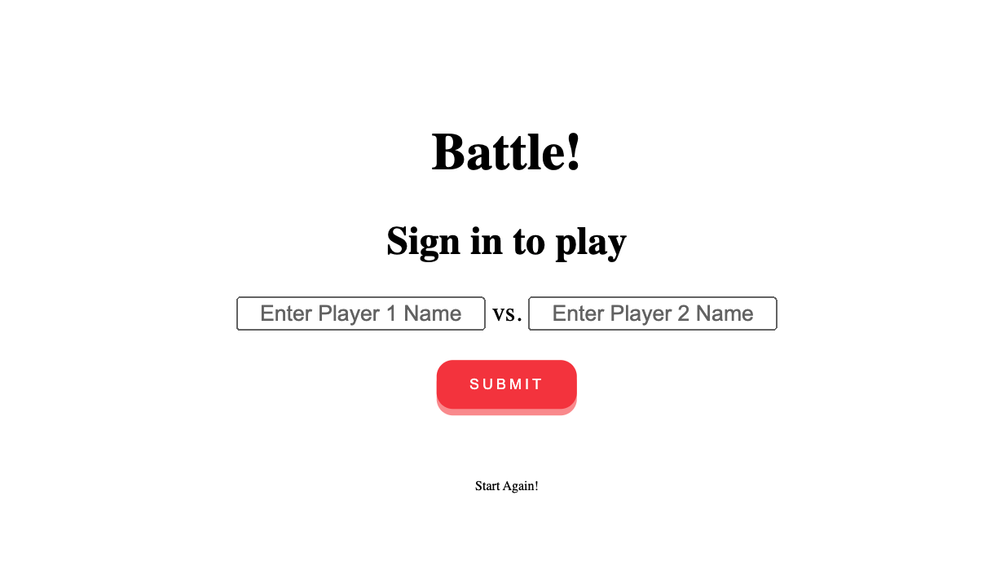

# Battle! :punch:

Understanting HTTP, responses, and requests mechanics using Sinatra and Capybara.




## User Stories

```
As two Players,
So we can play a personalised game of Battle,
We want to Start a fight by entering our Names and seeing them

As Player 1,
So I can see how close I am to winning
I want to see Player 2's Hit Points

As Player 1,
So I can win a game of Battle,
I want to attack Player 2, and I want to get a confirmation

As Player 1,
So I can start to win a game of Battle,
I want my attack to reduce Player 2's HP by 10

As two Players,
So we can continue our game of Battle,
We want to switch turns

As Player 1,
So I can see how close I am to losing,
I want to see my own hit points

As Player 1,
So I can lose a game of Battle,
I want Player 2 to attack me, and I want to get a confirmation

As Player 1,
So I can start to lose a game of Battle,
I want Player 2's attack to reduce my HP by 10
```


## How to use it
Install Gems required using bundler:
```
bundle install
```

Start the server in the terminal using:
```
ruby app.rb
```
Note down the port number and access the website via:
http://localhost:PORT_NUMBER